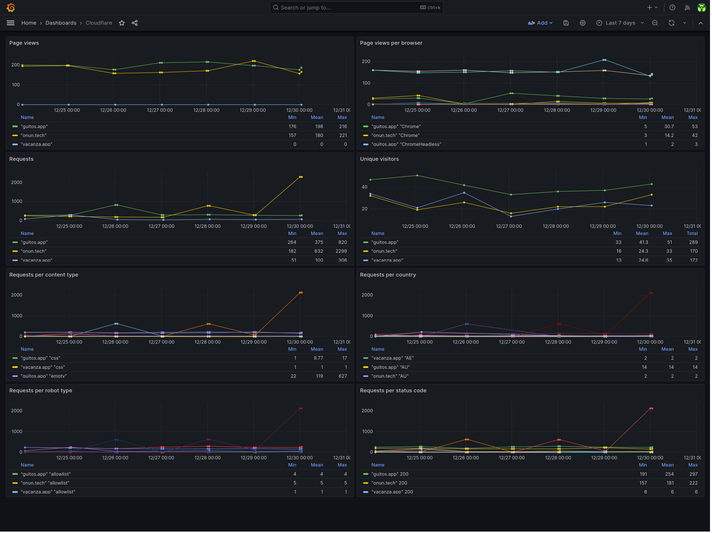

# cloudflare-exporter

Bash script that uploads the Cloudflare Analytics API data to influxdb on an hourly basis

## Dependencies

- [bash](https://www.gnu.org/software/bash/)
- [coreutils (cat)](https://www.gnu.org/software/coreutils/)
- [coreutils (date)](https://www.gnu.org/software/coreutils/)
- [curl](https://curl.se/)
- [gzip](https://www.gnu.org/software/gzip/)
- [influxdb v2+](https://docs.influxdata.com/influxdb/v2.6/)
- [jq](https://stedolan.github.io/jq/)
- [systemd](https://systemd.io/)
- Optional:
  - [make](https://www.gnu.org/software/make/) - for automatic installation support
  - [docker](https://docs.docker.com/)

## Relevant documentation

- [Cloudflare API](https://developers.cloudflare.com/analytics/graphql-api/)
- [Cloudflare GraphQL Schema](https://pages.johnspurlock.com/graphql-schema-docs/cloudflare.html)
- [InfluxDB API](https://docs.influxdata.com/influxdb/v2.6/write-data/developer-tools/api/)
- [Systemd Timers](https://www.freedesktop.org/software/systemd/man/systemd.timer.html)
- [reddec/compose-scheduler](https://github.com/reddec/compose-scheduler)

## Installation

### With Docker

#### docker-compose

1. Configure `cloudflare_exporter.conf` and `cloudflare_zone_list.json` (see the configuration section below).
1. Run it.

   ```bash
   docker compose up --detach
   ```

#### docker build & run

1. Build the docker image.

   ```bash
   docker build . --tag cloudflare-exporter
   ```

1. Configure `cloudflare_exporter.conf` and `cloudflare_zone_list.json` (see the configuration section below).
1. Run it.

   ```bash
   docker run --rm --init --tty --interactive --volume $(pwd):/app localhost/cloudflare-exporter
   ```

### With the Makefile

For convenience, you can install this exporter with the following command or follow the manual process described in the next paragraph.

```bash
make install
$EDITOR $HOME/.config/cloudflare_exporter.conf
$EDITOR $HOME/.config/cloudflare_zone_list.json
```

### Manually

1. Copy `cloudflare_exporter.sh` to `$HOME/.local/bin/` and make it executable.

2. Copy `cloudflare_exporter.conf` and `cloudflare_zone_list.json` to `$HOME/.config/`, configure them (see the configuration section below) and make them read only.

3. Copy the systemd unit and timer to `$HOME/.config/systemd/user/`:

   ```bash
   cp cloudflare-exporter.* $HOME/.config/systemd/user/
   ```

4. and run the following command to activate the timer:

   ```bash
   systemctl --user enable --now cloudflare-exporter.timer
   ```

It's possible to trigger the execution by running manually:

```bash
systemctl --user start cloudflare-exporter.service
```

### Config file

The config file has a few options:

```bash
INFLUXDB_HOST='influxdb.example.com'
INFLUXDB_API_TOKEN='ZXhhbXBsZXRva2VuZXhhcXdzZGFzZGptcW9kcXdvZGptcXdvZHF3b2RqbXF3ZHFhc2RhCg=='
ORG='home'
BUCKET='cloudflare'
CLOUDFLARE_API_TOKEN='ZXhhbXBsZXRva2VuZXhhcXdzZGFzZGptcW9kcXdvZGptcXdvZHF3b2RqbXF3ZHFhc2RhCg=='
```

- `INFLUXDB_HOST` should be the FQDN of the influxdb server.
- `ORG` should be the name of the influxdb organization that contains the cloudflare data bucket defined below.
- `BUCKET` should be the name of the influxdb bucket that will hold the cloudflare data.
- `INFLUXDB_API_TOKEN` should be the influxdb API token value.
  - This token should have write access to the `BUCKET` defined above.
- `CLOUDFLARE_API_TOKEN` should be the cloudflare API token value.
  - This token should be assigned the `All zones - Analytics:Read` permission.

### Zone list file

The zone list file should contain a list of zone ids and domain names in json format:

```json
[
  { "id": "999999aba99dd9999ef99ab78965ab1c", "domain": "example.com" },
  { "id": "111111aba11dd1111ef11ab11111ab1c", "domain": "example2.com" }
]
```

## Troubleshooting

Run the script manually with bash set to trace:

```bash
bash -x $HOME/.local/bin/cloudflare_exporter.sh
```

Check the systemd service logs and timer info with:

```bash
journalctl --user --unit cloudflare-exporter.service
systemctl --user list-timers
```

## Exported metrics

- cloudflare_stats_browser: Page views broken down by browser
- cloudflare_stats_content_type: Request statistics broken down by content type
- cloudflare_stats_countries: Request statistics broken down by country
- cloudflare_stats_ip: Request statistics broken down by robot type
- cloudflare_stats_responses: Request statistics broken down by response status code
- cloudflare_stats: General request statistics

## Exported metrics example

```bash
cloudflare_stats_browser,zone="example.com",browserFamily="ChromeMobileWebview" pageViews=2 1703894400
cloudflare_stats_content_type,zone="example.com",edgeResponse="txt" bytes=11089,requests=8 1703894400
cloudflare_stats_countries,zone="example.com",country="CA" bytes=312170,requests=14,threats=0 1703894400
cloudflare_stats_ip,zone="example.com",ipType="searchEngine" requests=21 1703894400
cloudflare_stats_responses,zone="example.com",status=403 requests=1 1703894400
cloudflare_stats,zone="example.com" bytes=2032039,cachedBytes=40607,cachedRequests=17,encryptedBytes=2020727,encryptedRequests=251,pageViews=178,requests=266,threats=0,uniqueVisitors=2 1703894400'
```

## Example grafana dashboard

In `cloudflare-dashboard.json` there is an example of the kind of dashboard that can be built with `cloudflare-exporter` data:



Import it by doing the following:

1. Create a dashboard
2. Click the dashboard's settings button on the top right.
3. Go to JSON Model and then paste there the content of the `cloudflare-dashboard.json` file.

## Uninstallation

### With the Makefile

For convenience, you can uninstall this exporter with the following command or follow the process described in the next paragraph.

```bash
make uninstall
```

### Manually

Run the following command to deactivate the timer:

```bash
systemctl --user disable --now cloudflare-exporter.timer
```

Delete the following files:

```bash
~/.local/bin/cloudflare_exporter.sh
~/.config/cloudflare_exporter.conf
~/.config/cloudflare_zone_list.json
~/.config/systemd/user/cloudflare-exporter.timer
~/.config/systemd/user/cloudflare-exporter.service
```

## Credits

- [reddec/compose-scheduler](https://github.com/reddec/compose-scheduler)

This project takes inspiration from the following:

- [rare-magma/pbs-exporter](https://github.com/rare-magma/pbs-exporter)
- [jorgedlcruz/cloudflare-grafana](https://github.com/jorgedlcruz/cloudflare-grafana)
- [mad-ady/prometheus-borg-exporter](https://github.com/mad-ady/prometheus-borg-exporter)
- [OVYA/prometheus-borg-exporter](https://github.com/OVYA/prometheus-borg-exporter)
