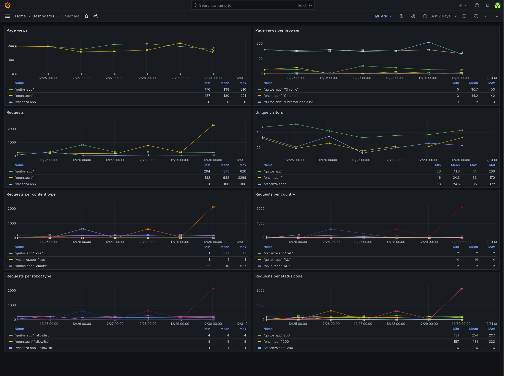

# cloudflare-exporter

CLI tool that uploads Cloudflare Analytics and Billable Usage API data to InfluxDB on an hourly basis.

## Dependencies

- [go](https://go.dev/)
- [influxdb v2+](https://docs.influxdata.com/influxdb/v2.6/)
- Optional:
  - [make](https://www.gnu.org/software/make/) - for automatic installation support
  - [docker](https://docs.docker.com/)
  - [systemd](https://systemd.io/)

## Relevant documentation

- [Cloudflare Analytics API](https://developers.cloudflare.com/analytics/graphql-api/)
- [Cloudflare Queues metrics](https://developers.cloudflare.com/queues/observability/metrics/)
- [Cloudflare Billable Usage API](https://developers.cloudflare.com/api/resources/billing/subresources/usage/methods/get_account_usage_v2)
- [Cloudflare AI Crawl Control GraphQL API](https://developers.cloudflare.com/ai-crawl-control/reference/graphql-api/)
- [Cloudflare GraphQL Schema](https://pages.johnspurlock.com/graphql-schema-docs/cloudflare.html)
- [InfluxDB API](https://docs.influxdata.com/influxdb/v2.6/write-data/developer-tools/api/)
- [Systemd Timers](https://www.freedesktop.org/software/systemd/man/systemd.timer.html)
- [reddec/compose-scheduler](https://github.com/reddec/compose-scheduler)

## Installation

### With Docker

#### docker-compose

1. Configure `cloudflare_exporter.json` (see the configuration section below).
1. Run it.

   ```bash
   docker compose up --detach
   ```

#### docker build & run

1. Build the docker image.

   ```bash
   docker build . --tag cloudflare-exporter
   ```

1. Configure `cloudflare_exporter.json` (see the configuration section below).
1. Run it.

   ```bash
   docker run --rm --read-only --cap-drop ALL --security-opt no-new-privileges:true --cpus 2 -m 64m --pids-limit 16 --volume ./cloudflare_exporter.json:/cloudflare_exporter.json:ro cloudflare-exporter
   ```

### With the Makefile

For convenience, you can install this exporter with the following command or follow the manual process described in the next paragraph.

```bash
make install
$EDITOR $HOME/.config/cloudflare_exporter.json
```

### Manually

1. Build the binary and copy it to `$HOME/.local/bin/`.

   ```bash
   go build -ldflags="-s -w" -o $HOME/.local/bin/cloudflare_exporter main.go
   ```

2. Copy `cloudflare_exporter.json` to `$HOME/.config/`, configure it (see the configuration section below), and make it read only.

3. Copy the systemd unit and timer to `$HOME/.config/systemd/user/`:

   ```bash
   cp cloudflare-exporter.* $HOME/.config/systemd/user/
   ```

4. Run the following command to activate the timer:

   ```bash
   systemctl --user enable --now cloudflare-exporter.timer
   ```

It is possible to trigger an execution manually:

```bash
systemctl --user start cloudflare-exporter.service
```

### Config file

The JSON config file has the following options:

```json
{
  "InfluxDBHost": "influxdb.example.com",
  "InfluxDBApiToken": "ZXhhbXBsZXRva2VuZXhhcXdzZGFzZGptcW9kcXdvZGptcXdvZHF3b2RqbXF3ZHFhc2RhCg==",
  "Org": "home",
  "Bucket": "cloudflare",
  "CloudflareApiToken": "ZXhhbXBsZXRva2VuZXhhcXdzZGFzZGptcW9kcXdvZGptcXdvZHF3b2RqbXF3ZHFhc2RhCg==",
  "CloudflareAccountEmail": "email@example.com",
  "CloudflareAccountTag": "aa0a0aa000a0000aa00a00aa0e000a0a"
}
```

- `InfluxDBHost` should be the FQDN of the influxdb server.
- `InfluxDBApiToken` needs write access to `Bucket`.
- `Org` should be the name of the influxdb organization that contains the cloudflare data bucket defined below.
- `Bucket` should be the name of the influxdb bucket that will hold the cloudflare data.
- `CloudflareApiToken` should be the influxdb API token value.
  - This token should be assigned the `All zones - Analytics:Read` and `Zone Read` permissions.
  - Additionally, the `Account Analytics:Read` permission is necessary for workers and Queues metrics.
  - The `Workers KV Storage Read` and `Queues Read` permissions allow automatic discovery of KV namespaces and Queues.
  - The `Billing Read` permission is necessary for billable usage metrics.
- `CloudflareAccountTag` should be the tag associated with the cloudflare account.
- Required for cloudflare accounts on a paid plan:
  - `CloudflareAccountEmail` is optional, should be the email associated with the paid cloudflare account.

## Troubleshooting

Run the binary manually from a directory containing `cloudflare_exporter.json`:

```bash
$HOME/.local/bin/cloudflare_exporter
```

Check the systemd service logs and timer info with:

```bash
journalctl --user --unit cloudflare-exporter.service
systemctl --user list-timers
```

## Exported metrics

- cloudflare_stats_browser: Page views broken down by browser
- cloudflare_stats_content_type: Request statistics broken down by content type
- cloudflare_stats_countries: Request statistics broken down by country
- cloudflare_stats_ip: Request statistics broken down by robot type
- cloudflare_stats_responses: Request statistics broken down by response status code
- cloudflare_stats_threats: Request statistics broken down by threat pathing
- cloudflare_stats: General request statistics
- cloudflare_stats_workers: Workers statistics grouped by hour
- cloudflare_stats_pf: Pages Functions statistics grouped by hour
- cloudflare_stats_kv_ops: KV operation statistics grouped by hour
- cloudflare_stats_kv_storage: KV storage statistics
- cloudflare_stats_queue_backlog: Queue backlog bytes and messages grouped by minute
- cloudflare_stats_queue_delayed_backlog: Delayed queue backlog messages grouped by minute
- cloudflare_stats_queue_consumers: Queue consumer concurrency grouped by minute
- cloudflare_stats_queue_operations: Queue operation counts and bytes grouped by minute
- cloudflare_stats_d1: D1 query volume, row, response-byte, and query-time statistics
- cloudflare_stats_d1_storage: D1 database storage size
- cloudflare_stats_d1_queries: D1 query count, rows read/written, and P50/P95/P99 query latency grouped by five-minute interval
- cloudflare_stats_r2_operations: R2 requests and response bytes grouped by bucket, storage class, and operation outcome
- cloudflare_stats_r2_storage: R2 bucket object and storage statistics grouped by storage class
- cloudflare_stats_email_sending: Email Service sending counts grouped by hour and delivery metadata
- cloudflare_stats_email_routing: Email Service routing counts grouped by hour and routing metadata
- cloudflare_stats_ai_crawl: AI crawler request and response-byte statistics grouped by hour, crawler user agent, and host
- cloudflare_billable_usage: Daily billable usage and costs grouped by service, service family, unit, and zone

## Exported metrics example

```bash
cloudflare_billable_usage,account=aa0a0aa000a0000aa00a00aa0e000a0a,billingCurrency=USD,service=KV\ Storage\ (GB\,\ First\ GB\ is\ included),serviceFamily=Workers\ KV,consumedUnit=GB-months consumedQuantity=0.000047330226388888887,pricingQuantity=0,contractedCost=0,billedCost=0,effectiveCost=0,cumulatedPricingQuantity=0,cumulatedContractedCost=0 1782864000
cloudflare_stats_ai_crawl,zone=example.com,crawler=Mozilla/5.0\ AppleWebKit/537.36\ (KHTML\,\ like\ Gecko;\ compatible;\ ClaudeBot/1.0;\ +claudebot@anthropic.com),host=example.com requests=1,edgeResponseBytes=7763 1786197600
cloudflare_stats_browser,zone=example.com,browserFamily=ChromeMobile pageViews=1 1786154400
cloudflare_stats_content_type,zone=example.com,edgeResponse=empty bytes=0,requests=1 1786183200
cloudflare_stats_countries,zone=example.com,country=BE bytes=361,requests=1,threats=0 1786190400
cloudflare_stats_d1,account=aa0a0aa000a0000aa00a00aa0e000a0a,database=24dba035-4372-488b-86e3-e94a5079a1eb readQueries=36,writeQueries=1,rowsRead=54,rowsWritten=1,queryBatchResponseBytes=59618,queryBatchTimeMs=0.3586783783783784,queryBatchTimeMsP90=0.58 1786147200
cloudflare_stats_d1_storage,account=aa0a0aa000a0000aa00a00aa0e000a0a,database=24dba035-4372-488b-86e3-e94a5079a1eb databaseSizeBytes=274432 1786147200
cloudflare_stats_ip,zone=example.com,ipType=noRecord requests=1 1786150800
cloudflare_stats_kv_storage,account=aa0a0aa000a0000aa00a00aa0e000a0a,namespace=24dba035-4372-488b-86e3-e94a5079a1eb byteCount=0,keyCount=0 1786197600
cloudflare_stats_r2_storage,account=aa0a0aa000a0000aa00a00aa0e000a0a,bucket=eu_example,storageClass=Standard objectCount=162,uploadCount=0,payloadSize=180342,metadataSize=5726 1786199400
cloudflare_stats_responses,zone=example.com,status=499 requests=1 1786183200
cloudflare_stats_threats,zone=example.com,threat=bic.ban.unknown requests=1 1786147200
cloudflare_stats,zone=example.com bytes=361,cachedBytes=0,cachedRequests=0,encryptedBytes=361,encryptedRequests=1,pageViews=0,requests=1,threats=0,uniqueVisitors=0 1786190400
```

## Example grafana dashboard

In `cloudflare-dashboard.json` there is an example of the kind of dashboard that can be built with `cloudflare-exporter` data:



Import it by doing the following:

1. Create a dashboard
2. Click the dashboard's settings button on the top right.
3. Go to JSON Model and then paste there the content of the `cloudflare-dashboard.json` file.

## Uninstallation

### With the Makefile

For convenience, you can uninstall this exporter with the following command or follow the process described in the next paragraph.

```bash
make uninstall
```

### Manually

Run the following command to deactivate the timer:

```bash
systemctl --user disable --now cloudflare-exporter.timer
```

Delete the following files:

```bash
~/.local/bin/cloudflare_exporter
~/.config/cloudflare_exporter.json
~/.config/systemd/user/cloudflare-exporter.timer
~/.config/systemd/user/cloudflare-exporter.service
```

## Credits

- [reddec/compose-scheduler](https://github.com/reddec/compose-scheduler)

This project takes inspiration from:

- [rare-magma/pbs-exporter](https://github.com/rare-magma/pbs-exporter)
- [jorgedlcruz/cloudflare-grafana](https://github.com/jorgedlcruz/cloudflare-grafana)
- [mad-ady/prometheus-borg-exporter](https://github.com/mad-ady/prometheus-borg-exporter)
- [OVYA/prometheus-borg-exporter](https://github.com/OVYA/prometheus-borg-exporter)
